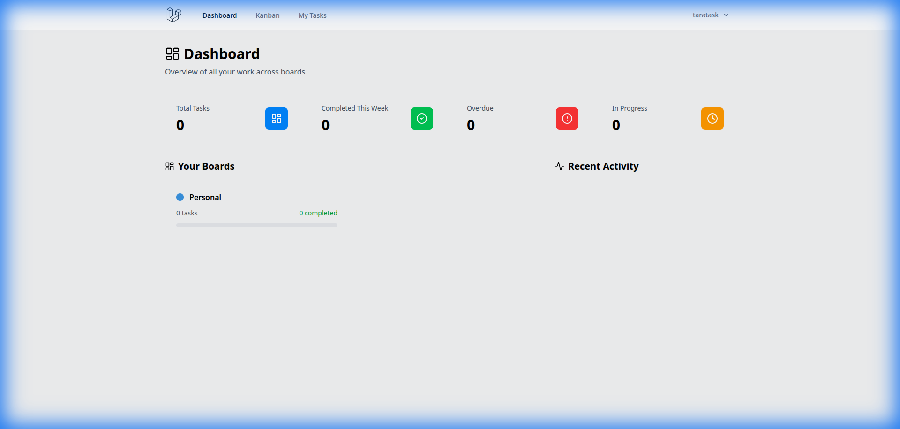
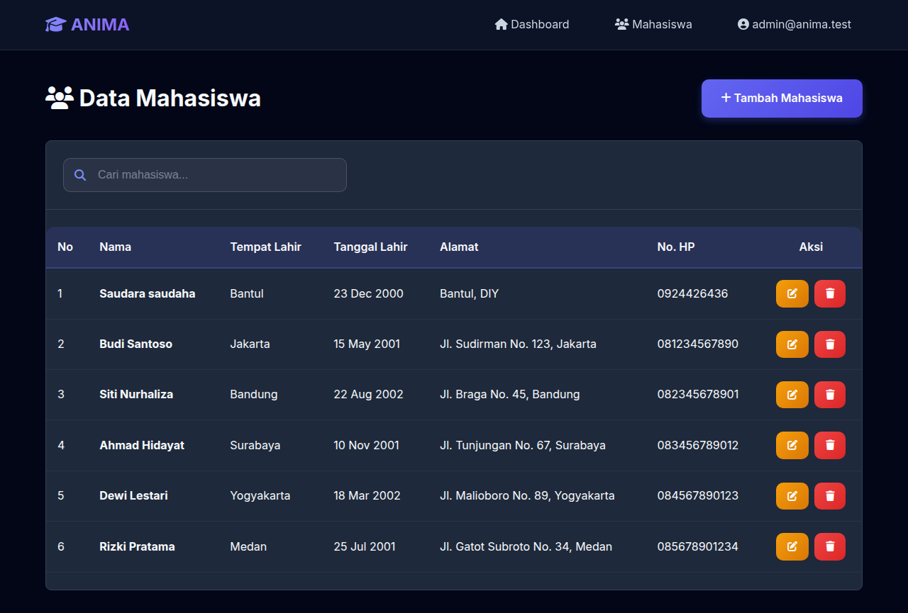

# ANIMA - Aplikasi Nilai Mahasiswa

Project Tugas Kuliah: Praktek Web Pemrograman Lanjutan

ANIMA adalah aplikasi web sederhana yang dibangun menggunakan Framework Laravel sebagai bahan pembelajaran dan tugas praktikum. Project ini dirancang untuk mendemonstrasikan penerapan konsep dasar pengembangan web modern, khususnya fitur CRUD (Create, Read, Update, Delete) dan manajemen data mahasiswa.

Tujuan dari repository ini adalah sebagai referensi belajar bagi sesama mahasiswa atau siapa saja yang sedang mendalami Laravel. Kami harap kode sumber dan dokumentasi ini dapat memberikan manfaat nyata dan membantu Anda memahami bagaimana sebuah aplikasi web dibangun dari nol.

## Apa yang Bisa Dipelajari?

Dari source code ini, Anda dapat mempelajari:
1.  Konsep MVC (Model-View-Controller): Bagaimana memisahkan logika aplikasi, data, dan tampilan.
2.  CRUD Operations: Cara membuat, membaca, mengedit, dan menghapus data dari database.
3.  Authentication: Sistem login dan register pengguna.
4.  Blade Templating: Cara membuat tampilan web yang dinamis dan reusable.
5.  Database Migrations: Cara mengelola struktur database menggunakan kode.

## Dokumentasi Belajar

Untuk membantu proses belajar, kami telah menyiapakan panduan tambahan di folder /docs:

-   Struktur Folder & MVC (docs/STRUCTURE.md): Penjelasan tentang struktur folder Laravel dan file-file penting di project ini.
-   Panduan Alur CRUD (docs/CRUD_GUIDE.md): Penjelasan langkah-demi-langkah bagaimana data mengalir dari Database ke Tampilan.
-   Tips Belajar Lanjutan (docs/LEARNING_PATH.md): Rekomendasi apa yang harus dipelajari selanjutnya setelah menguasai project ini.

## Fitur Aplikasi

-   Dashboard Ringkas: Statistik sederhana data mahasiswa.
-   Manajemen Mahasiswa: Form tambah, edit, dan hapus data.
-   Laporan: Export data ke CSV dan fitur cetak laporan.
-   Manajemen Akun: Update profil dan ganti password.
-   Desain UI Modern: Tampilan bersih dan rapi.

## Tampilan Aplikasi

Berikut adalah cuplikan tampilan aplikasi ANIMA:

### Dashboard Utama
Halaman awal yang menampilkan statistik ringkas data mahasiswa.

### Daftar Mahasiswa
Halaman untuk melihat, mencari, dan mengelola data mahasiswa.

## Instalasi (Cara Menjalankan)

Ikuti langkah ini untuk menjalankan aplikasi di komputer Anda:

1.  Clone Repository
    git clone https://github.com/tarakreasi/anima.git
    cd anima

2.  Install Library Pendukung
    composer install
    npm install

3.  Setting Database
    -   Copy file .env.example lalu ubah namanya menjadi .env.
    -   Buka file .env dan atur koneksi database (DB_DATABASE, DB_USERNAME, dll).
    -   Generate key aplikasi:
        php artisan key:generate

4.  Siapkan Database & Data Dummy
    php artisan migrate --seed

5.  Jalankan Aplikasi
    npm run dev
    php artisan serve

    Buka browser dan akses halaman localhost sesuai port yang tertera.

---
Dibuat untuk berbagi ilmu dan referensi belajar bersama.
